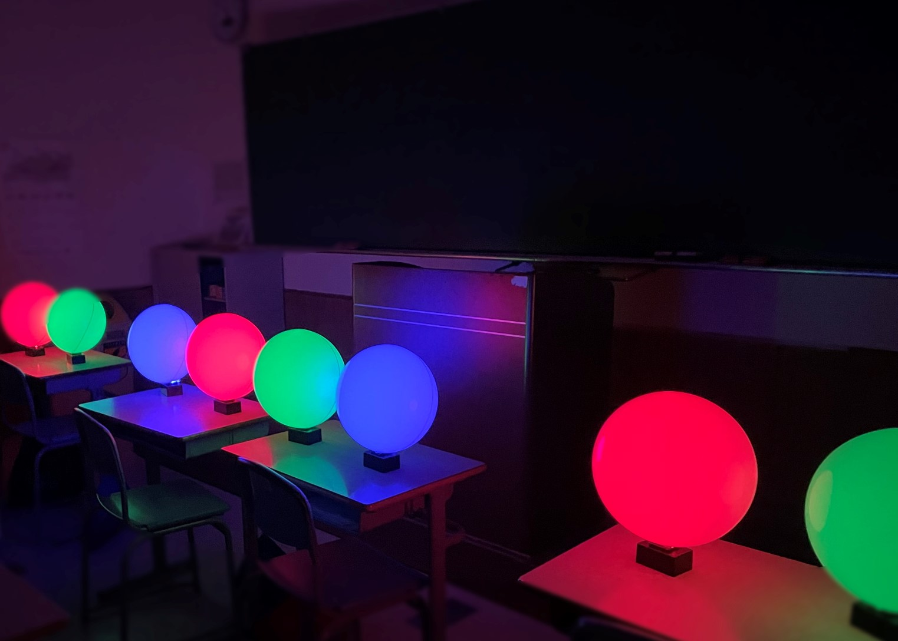

# art-project



## Description

Interactive art using microcomputers

- Arduino Software

  The software to generate programs to write to Arduino.

- LED Controller
  
  The main software that controls LEDs.

- Music Player
  
  The software that plays music based on signals sent from the LED Controller.

## How to Use

### Arduino Software

1. Change directory:

```bash
cd arduino/software
```

2. Install the dependencies:

```bash
npm install
```

3. Put `.env` in `./arduino/software`:

```
WiFi_SSID = '"****"'
WiFi_PASSWORD = '"****"'
IP_ADDRESS_IP = '***, ***, ***, ***'
IP_ADDRESS_GATEWAY = '***, ***, ***, ***'
IP_ADDRESS_SUBNET = '***, ***, ***, ***'
OSC_PORT = '*****'
```

4. Put `units.json` in `./arduino/software/data`:

```json
{
  "main_units": [{
    "name": "main1",
    "mac": "{0x00,0x00,0x00,0x00,0x00,0x00}"
  }, {
    "name": "main2",
    "mac": "{0x00,0x00,0x00,0x00,0x00,0x00}"
  }],
  "units": [{
    "number": 1,
    "name": "unit1",
    "mac": "{0x00,0x00,0x00,0x00,0x00,0x00}"
  }]
}
```

5. Run node.js:

```bash
npm run build
```

### LED Controller

1. Move files in `ledController` to openframeworks project.

### Music Player

1. Move files in `musicPlayer` to openframeworks project.
